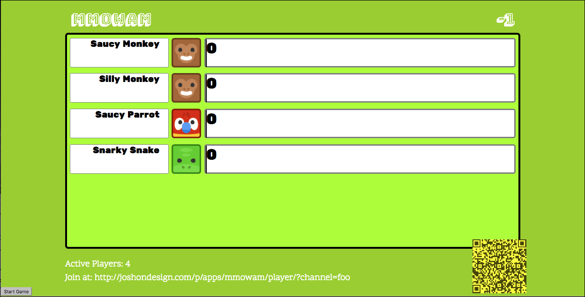
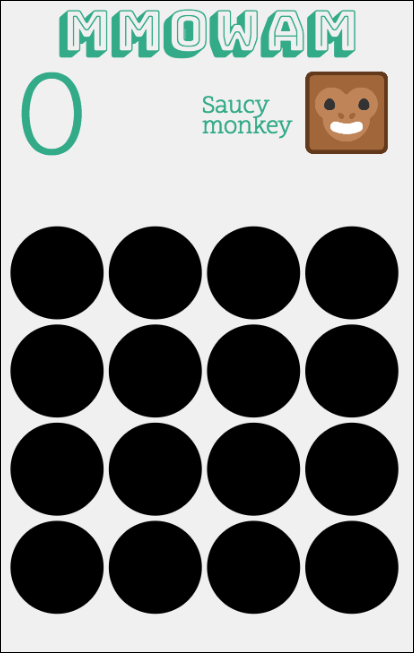
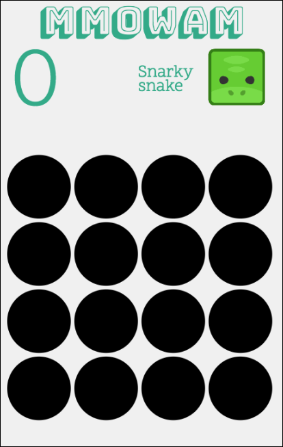
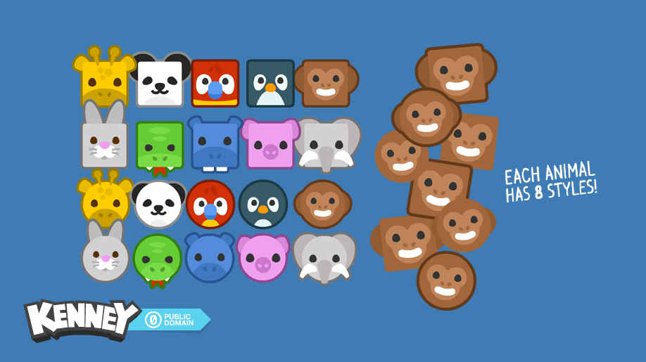

# MMOWAM:  Massively Multiplayer Online Whack-A-Mole

This blog is based on my talk from NodePDX 2016. You can watch [the full video of my session](https://www.youtube.com/watch?v=M0InR6sjH_Y&feature=youtu.be), or
read my other writings on [my personal blog](http://joshondesign.com/).

# Building a Casual Gaming MMO

Today I'm going to build a casual Massively Multiplayer Online game. Something that can have 50 or more people playing at the same time.  And I’m going to do it without writing any server side code. Yes, no server code at all. Your first question is probably: *Why on earth would anyone want to do this*? Why are you going to make an MMO without any server side code?

In my day job I work on [realtime networks](http://www.pubnub.com/) for a startup in San Francisco. Most of our customers use our DSN (Data Stream Network) for chat applications and vehicle tracking. This makes sense, people like to communicate and they want to know when the bus is coming. When the RFP came up for [NodePDX](http://nodepdx.org) (Portland's Premier JavaScript conference) one of my co-workers suggested I build a game 
instead of the usual chat app.

The challenge is I'm not really a gamer anymore. I don't have the time to get deep into games, and certainly not the time to become competitive with guys who spend hours and hours honing their craft. Instead I like playing games with people around me.  I like board games and Mario Kart. Games anyone can pick up and enjoy, with no prior training. So my challenge was to create a game that's both realtime and can accommodate far more people than a board game could handle. What would it be like to play with 20 people at once, when you're all in the same room?  That led me to one of my all-time favorite boardwalk games: [Whack-A-Mole](https://en.wikipedia.org/wiki/Whac-A-Mole).

Whack-A-Mole is awesome. It requires no learning; even little kids can play it. It does have some skill, but you can get pretty far knowing nothing at all.  And most importantly, it's fun whether are winning or losing. Everyone loves smashing cute cartoon creatures. (It also happens to be fairly easy to code. No 3D modeling required.) Now imagine if you could play Whack-A-Mole on a big screen TV or projector, but let everyone use their existing smartphone as their controller.  This is the dream.

While Whack-A-Mole is conceptually simple, actually getting a bunch of people to seamlessly connect to a game introduces it's own challenges.  To keep things simple I introduced a couple of requirements:

* *web only* The game will be on the web, using only standard web tech (JS, CSS, webfonts, etc.) Trying to build a game for every app store would be a headache, as would asking everyone to go to their store, find the app, install it, then load it up. Instead I can just give everyone a URL to load. Boom, you're in!
* *no accounts* I want a game that can run on a TV at a party. If someone wants to join in they should be able to do it in five seconds. No accounts or logins. No verifying email. No synchronizing worlds. Joining should be a simple and immediate action.

* *no server* This is a free game so I don't want any server infrastructure for synchronizing games and managing state. I have a static web server for hosting the HTML, but that's it. Nothing to keep running and monitor. I don't have the resources or time for that. Synchronizing will be minimal and use a service.

# the UI

My game has two pages, one for the big screen and one for the player's phones.  The big screen is the dashboard. It shows when a round starts and who's winning.  The phone UI shows the game board. It tells the player when to start playing, then gives them a grid of holes to tap on. It currently shows the moles by turning a circle red. A better version would have had little cartoon moles, but I didn't have time before the conference. I'll add that later. BTW, the source to all of this is in my [MMOWAM github repo](https://github.com/joshmarinacci/mmowam).

Here’s what the dashboard looks like on a large screen, say a TV or a projector at a conference.



Here’s what the client looks like on a phone.




Since you're reading this on a game developer website I assume you have your own favorite framework, so I won't go through all of the code for the actual game UI parts. It's all pretty straight forward web coding. I didn't use any game frameworks. The dashboard is plain HTML with CSS and a few property animations. The client uses bog standard HTML Canvas. They share a few common utility functions for event handling and animation in the `common` directory of the [source repo](https://github.com/joshmarinacci/mmowam).

# The Networking


Now that we have a basic app, how do we get actually connect players together?  The magic part is a [Data Stream Network](https://www.pubnub.com/products/global-data-stream-network/). This is a service which runs high performance low-latency data stream channels over the global Internet. The data all goes through their network, not your own server, so we can call it from static HTML. It sends JSON messages, sort of like web-sockets, but at a massive scale. They handle keeping latency down, reliability up, etc. PubNub provides a high volume free tier so traffic won't be a problem. The DSN handles the basic mechanics of connecting players but we still have a few problems to solve:

* There could be more than one TV showing a dashboard at a once. How can they each host their own game without having a real server?
* How do players connect specifically to the dashboard they see in front of them, not some other random dashboard (alternatively, how do we prevent people who aren't actually at the event from joining the game)
* How do we make sure players don't mistype the URL if it's a long with with game host information in it. Long URLs are error prone to type in on a phone.
* If there aren't any accounts or usernames, then how do players know which person they are on the dashboard?
* How do we synchronize the game boards in realtime without sending a lot of data, including starting each round at the exact same time so no one can cheat.

Let's take these one by one.


# Channel Names for Multiple Games

First, we need some sense of a game world that players can join. Channels in the DSN each have unique names, so we can generate a random channel name and use that for our game world. If everyone connects to the same channel then they will be playing the same game. This also lets us encode the game world into a parameter of a link. Yes a fully shareable link that can go anywhere on the web (or email, or twitter, or messaging, or...) Of course typing a long random number by hand is annoying, so instead let's generate a random series of words instead.


For this game I connect to the PubNub network with my publish and subscribe keys, then  generate a channel name by randomly picking three values from a set of colors, flavors, and animals.


```
<script type="text/javascript" src="https://cdn.pubnub.com/pubnub-3.15.1.js"></script>
<script type=”text/javascript”>
pubnub = PUBNUB({
   publish_key:"pub-c-f68c149c-2149-48dc-aeaf-ee3c658cfb8a",
   subscribe_key:"sub-c-51b69c64-3269-11e6-9060-0619f8945a4f",
   uuid:'dashboard'
});


var state = {};

var COLORS = ["red","green","blue","orange","black","white","purple",'brown','gray'];
var FLAVORS = ["salty",'sweet','spicy','tangy','sour','bland'];
var ANIMALS = ['bear','cat','chipmunk','dog','wolf','fox','lion','tiger','elephant'];
state.channelName = pick(COLORS)+'-'+pick(FLAVORS) + '-' + pick(ANIMALS);
```

Now I can publish messages for the players to receive like this:

```
pubnub.publish({
   channel:state.channelName,
   message: { "type":"action",  "action":"start" }
});
```


A player can join the game by typing the channel name into a text box when they load up the page. Alternatively we could store the channel in the URL and tell them to just load up a particular URL.

# Typing in Long URLs

This introduces a new problem, though. Suppose we want the player to type in a long URL like this:

```
http://joshondesign.com/p/apps/mmowam/player/?channel=gray-salty-elephant
```

One mistake and you get a 404 error, or worse you get to the page but to a slightly different channel and you don’t realize it. Suddenly you are playing the wrong game! But there's a better way: use a QR Code using this awesome JS library from [Sangmin Shim](https://github.com/davidshimjs/qrcodejs).

```
// thanks Sangmin Shim
// https://github.com/davidshimjs/qrcodejs

new QRCode(document.getElementById("qrcode"), {
   width: 128,
   height: 128,
   colorDark : "#444400",
   colorLight : "#ffff00",
   text:BASE_URL+state.channelName
});
```

Using this amazing library in just a few lines of code you can generate the QR code in the browser with HTML Canvas. If we display this URL on the dashboard then someone can just scan it to immediately join the game. I love *the immediacy* of QR codes. Scan and you are ready to play. (now, if only Apple would recognize QR codes in their default camera app).


Now we can connect all the players, but how does one player know who they are on the dashboard if we don't have accounts or user names. How do we show who wins? When in doubt, randomly generate something.

Here's what it looks like:


```
var ICONS = ['elephant','giraffe','hippo','monkey','panda','parrot','penguin','pig','rabbit','snake'];
var ADJECTIVES = ['Saucy',"Sweet","Snarky",'Silly','Sassy'];

playerState.uuid = PubNub.uuid();
playerState.adjective = calculateAdjective();
playerState.icon = calculateAnimal();
img.src = "../images/sqr/"+playerState.icon+".png";

function calculateAdjective() {
   var key = 'mmowam-player-adjective';
   if(!sessionStorage.getItem(key)) sessionStorage.setItem(key, pick(ADJECTIVES));
   return sessionStorage.getItem(key);
}
//calculateAnimal() looks similar
```


Notice that I also generate a real UUID for distinguishing each player. This is great for the computer to really know who a message came from, just compare to previous UUIDs; but it's horrible for the human players. We don’t want to say: "Congratulations player 45823XD6. You’ve won!""  

In addition the UUID, the code above makes a random animal name, icon, and adjective to easily distinguish players. Later we can print this name at the top of the player's screen so they can just match the dashboard with what they see on their phone.

Also note that I saved the player info in session storage so if the user hits reload they still get the same player settings.


# Filling in the Dashboard

Now we get to some real networking code. After the player's screen loads and generates unique info for them, we'll send this player state to the dashboard through the common channel. We could send this as regular messages but what happens if a player loads their screen just a tiny bit before the dashboard, or if it has to reload. The dashboard might miss a player message. We need some sort of persistent state.

In a traditional system this would be the job of the central server to handle identity, but we don’t want a central server. It turns out the DSN also has the ability to [store a little bit of state](https://www.pubnub.com/docs/web-javascript/api-reference#user-state).  Using the `state()` function we can add extra values we want to store like this.


```
var playerState = {
   uuid:"unknown-uuid",
   adjective:"", //these are set above
   icon:"",
   score:0
};

function updateState() {
   pubnub.state({
       channel:CHANNEL_NAME,
       state: playerState
   });
}
```

The magic is that you can set it and forget it. The other members of the channel can query the state at any time, for one or multiple users, whether or not the current user is actually connected at this particular instant. The network preserves this state so each client doesn’t have to resend it over and over.

Further more, every time someone joins or leaves the game it generates a join or leave event. The dashboard listens for these events to update the player list. The `join` event also includes the state of that client, so we automatically get the icon and name of each user. Here's what my code looks like in the dashboard.

```
pubnub.subscribe({
   channel:CHANNEL_NAME,
   message: function(msg,env,chan) {
       //console.log("got a message",msg,env,chan);
   },
   disconnect: function() {
     // cleanup stuff
   },
   presence: function(m) {
       state.playerCount = m.occupancy - 1; //don't count the dashboard

       if(m.action == 'state-change') {
           setPlayerState(m); //update an individual player's info
       }

       sync(); //update the player list on scree
   }
});
```


To keep score, we can again use the state. Each player tracks their own score, when they update the score value, just set the state and it’s propagated to anyone who cares. This we could have multiple dashboards for the same game world. Remember, there is nothing special about our dashboard. It’s not a server. It’s just another client. We could have one game dashboard for the current game, one historic page that shows all games over time in this channel, and a global one for all games everyone being played right now.

# Synchronizing the Game

Now we can connect players, show their status and score, and give them unique identities. The last task is to start and stop the game at the same time for all players, and give them the same game boards.  We can start the game by just sending a start message from the dashboard, then everyone will start their games within 1/4 of a second of each other (PubNub guarantees less than quarter second latency). That part is easy.

However, to really be fair we need to have everyone use the same game board. The same holes should have the same moles in the same pattern. We could send out a mole event every second to determine which hole it is, but that generates a lot of traffic and doesn’t account for when some players are faster than others. A better solution is to use a seed with a pseudo-random number generator (pRNG).

Computers generally don’t create true random numbers. They generate what are called pseudo-random numbers. There is some function which takes an input value and returns an output value based on a simple (or not-so-simple) math calculation , plus a seed value. This gives you what looks like a series of random numbers, but if you start with the same initial seed *you’ll always get the same sequence*. This is the magic part. If we send the same seed to each client and they all use the same math calculation, then they will all get the same game board, *even if they are separated in time and space*.

Below is the code to start the game. It sends a start action along with a new random seed for this round.

```
//dashboard side
function startGame() {
   state.isPlaying = true;
   state.randomSeed = Math.floor(Math.random()*10*1000);
   pubnub.publish({
     channel:CHANNEL_NAME,
     message: {
       "type":"action",
       "action":"start",
       "data": {
           "seed":state.randomSeed
       }
   }
});
}
```

On the client side, each player's phone picks the next hole to light up using the same pRNG function with the seed for that round.   This ensures everyone gets the same hole sequence.

```
//player side
function pickRandomHole(grid) {
   var max = grid.length;
   var min = 0;
   mathSeed = (mathSeed * 9301 + 49297) % 233280;
   var rnd = mathSeed / 233280;
   var val = min + rnd * (max - min);
   return Math.floor(val);
}
```

# Make It Nice

That's the core of our game. The rest is just making it pretty. Since I mostly used standard CSS and Canvas I'll just cover a few interesting details.

CSS now has vmin/vmax/hmin/hmax units which equal 1% of the max and min width and height of the page. Combined with FlexBox you can easily center and scale a div to fit the page.

```
Scalable HTML (vmin/vmax & flexbox are awesome!)
#screen-wrapper {
   position: absolute;
   display: flex;
   align-items: center;
   justify-content: center;
   width: 100%;
   height: 100%;
}

#screen {
   /* 16x10 = */
   width: 160vmin;
   height: 100vmin;
   font-size: 1vmin;
   position: relative;
}
```

I received some wonderful retro sounding music from a composer friend of mine, Philip Serino. You can listen to the tracks on [his SoundCloud page](https://soundcloud.com/philip-vincent-serino/wonderland)

The icons for the game all came from [Kenny.nl's awesome Animal Pac](http://kenney.nl/assets/animal-pac)




# Future Work

My vision is for in-person casual games played by massive numbers of people. Different screens across multiple platforms working together for maximum gaming fun! I can easily see this idea extended to interactive games at parties, interactive exhibits at children's museums, or collaborative music at conventions.  The very concept of massively multi-player casual games got me to thinking:


* What would 10 person Tetris be like? Would you play against each other or together?
* What about a snake game where the players *vote on the snake’s direction* at every timestep?
* MMO-Presentations: Attendees could vote and chat on top of a live video stream of your 
presentation in realtime, *like MTV Popup Video*. Horrifying!

Thank you. Let’s Play!


# Play Now

To try the game yourself have one person [load the dashboard](http://joshondesign.com/p/apps/mmowam/dash/) and turn up the volume (all  music comes from the dashboard).
 
Then each player can load the game client from the URL printed on the dashboard. Alternatively, they can load [this page](http://joshondesign.com/p/apps/mmowam/player/) and then type in the channel name, or of course use the QR code.
 
Once your players in the game, press the start button!


* The [full source](https://github.com/joshmarinacci/mmowam) on GitHub
* The [live dashboard](http://joshondesign.com/p/apps/mmowam/dash/) of the game
* PubNub [docs for JavaScript](https://www.pubnub.com/docs/web-javascript/pubnub-javascript-sdk)


